# TRACK - Konkur Version
keep track of all your lessons with simple steps. 🍰

## installation

1. clone the repo

2. run ```npm i```

3. start application using ```npm start```

4. enjoy 😀

## how it works

Here you have a hierarchial structure for your lessons:

Every **Lesson** has multiple **Grade**s,

Every **Grade** has multiple **Unit**s,

Every **Unit** has multiple *Notes* & **Subunit**s,

Finally Every **Subunit** has multiple *Notes*.

| Level  | Content |
| -----  | ------- |
| Lesson | **Grade**s   |
| Grade  | **Unit**s    |
| Unit   | **Subunit**s & *Notes*|
| Subunit   | *Notes* |

## mobile friendly 📱

This application can be easily used with mobile devices. you're gonna like it :wink:.

# Pages 📃

## Homepage 🔍

You can access all **Lessons** and **Grades** from Homepage!

Add a new **Lesson** by entering a name in the box on top of the footer and clicking plus sign.

Browser View :

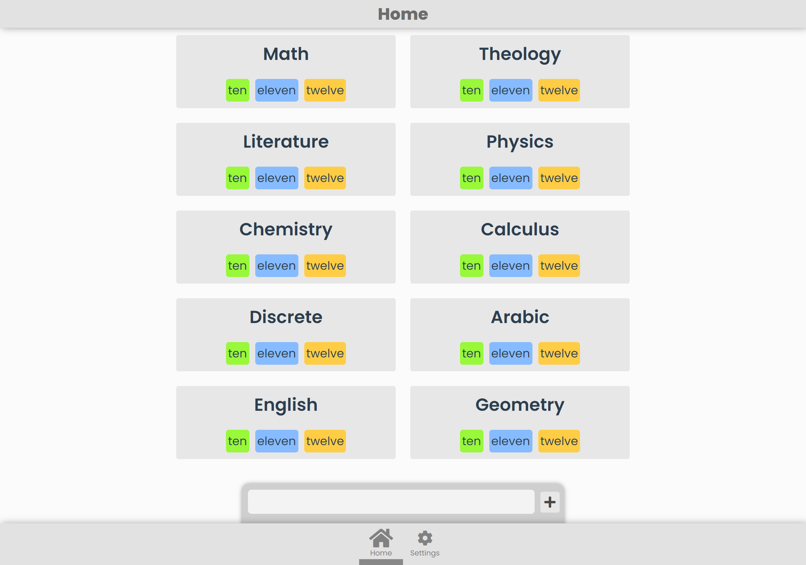

Mobile View :

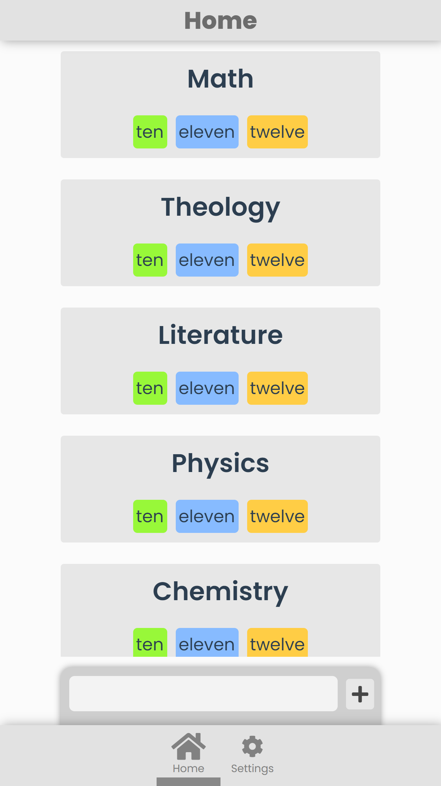

## Lesson Page 📚

A simple menu for navigating to your desired **Grade**.

Browser View :

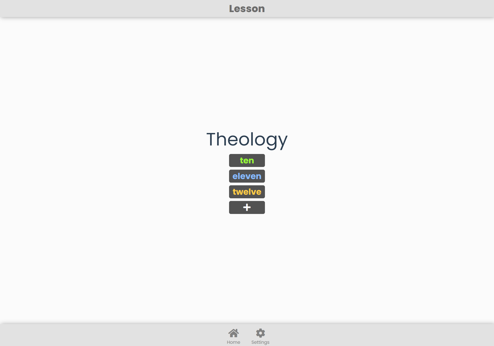

Mobile View :

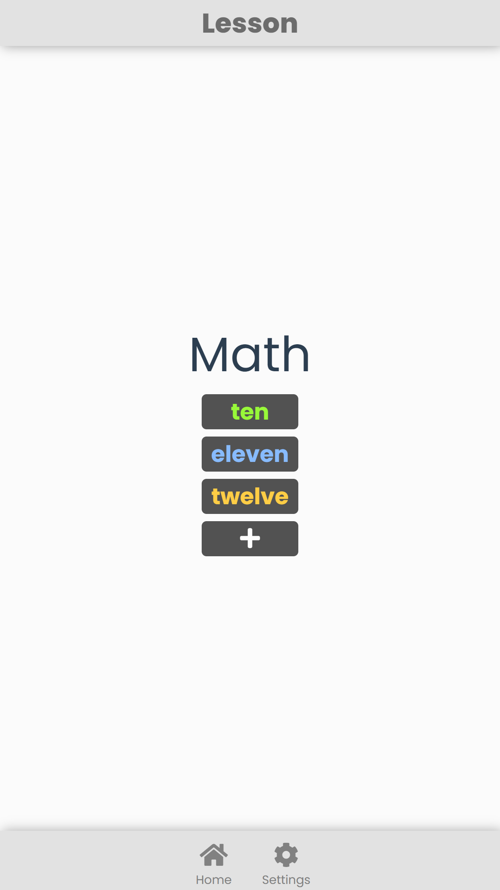

## Grade Page 📘

You can see all **Units** in a **Grade** on this page.

Browser View :

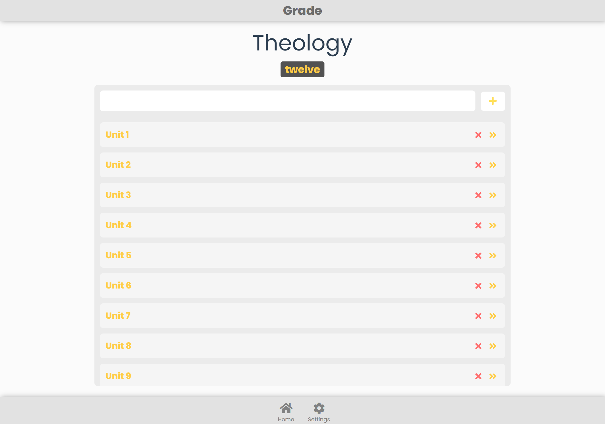

Mobile View :

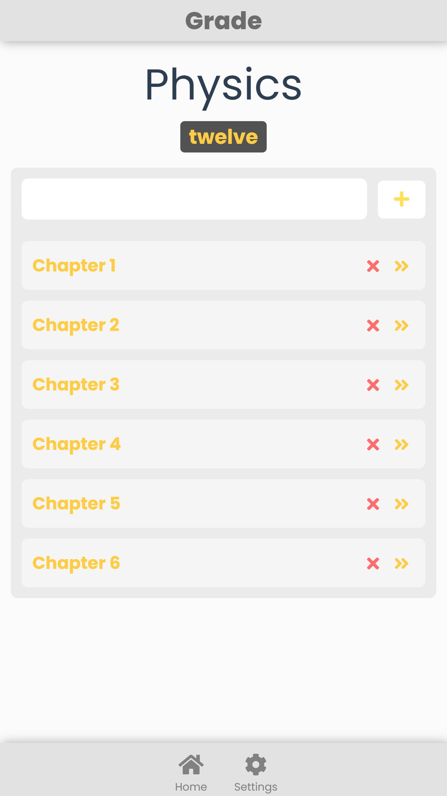

## Unit Page 📖

On **Unit** Page you can access **Unit**'s respective *Note*s & **Subunit**s.

Browser View :

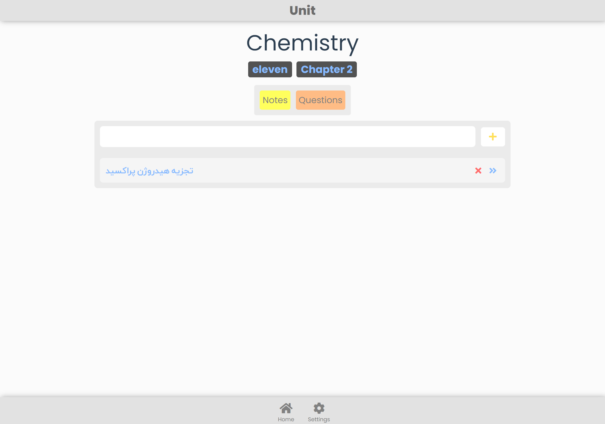

Mobile View :

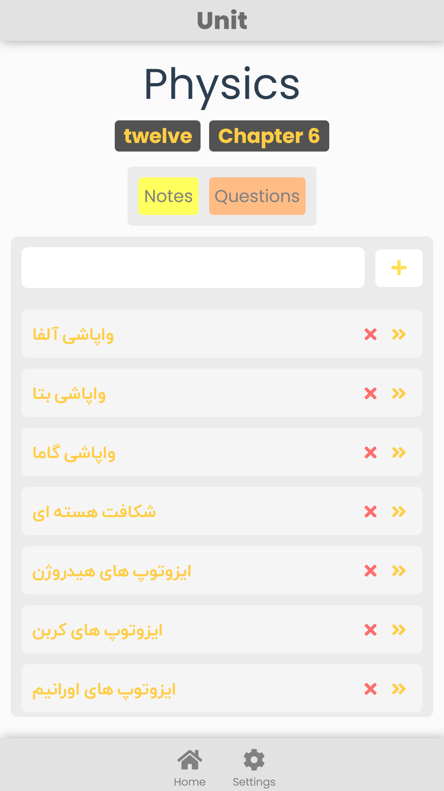

## Unit Notes 📜

Read & add *Note*s to the **Unit** you are in.

This page is a **Unit**-level *Note* page.

Browser View :

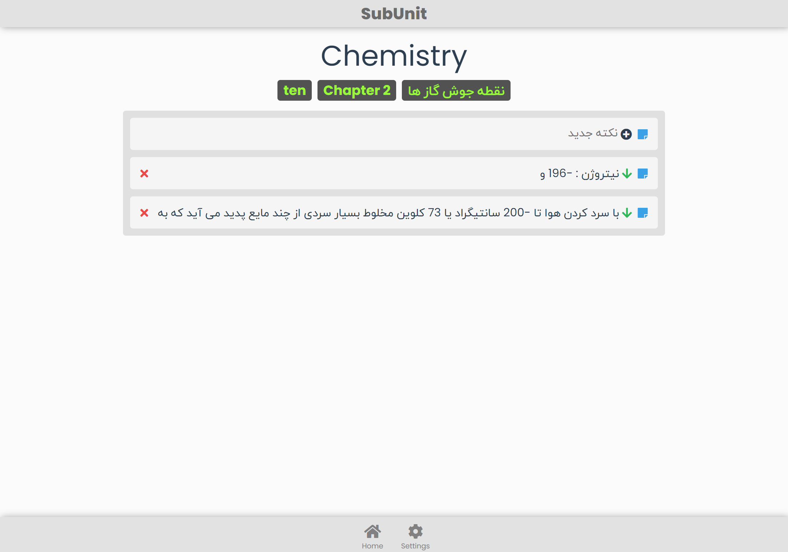

Mobile View :

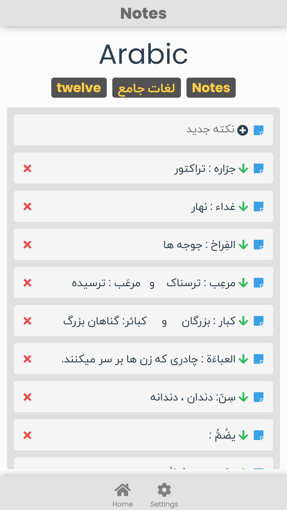

## Subunit Notes 📄

Your *Note*s in a **Subunit**.

Browser View :

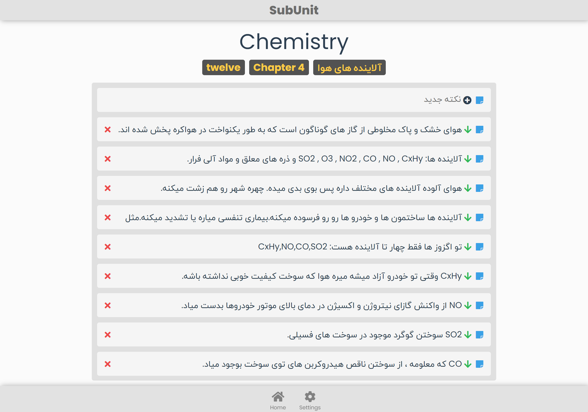

Mobile View :

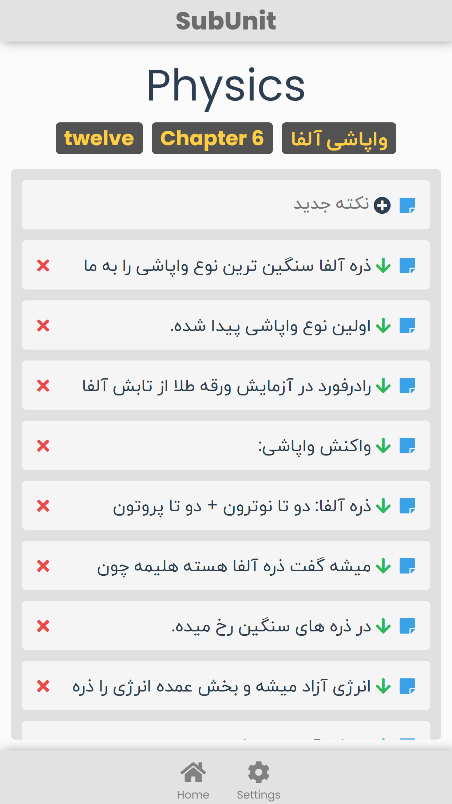

# Project Status 😀

The project hasn't been completed; for instance ***Settings*** Page serves no purpose 😄. I would appreciate any contribution to this project❤. :dove: